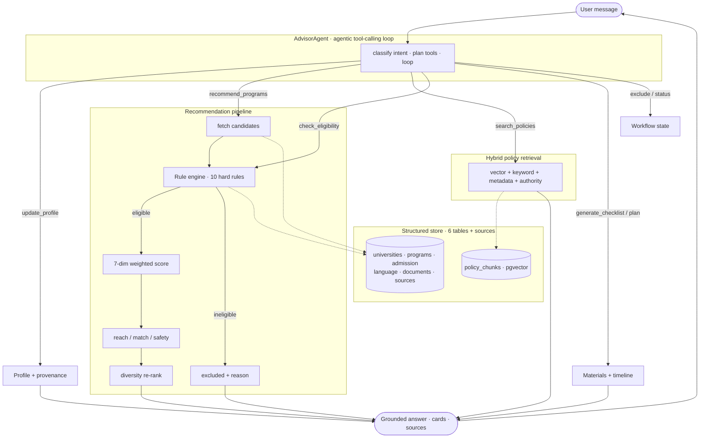

# Apply Advisor

An AI advisor for master's applications to Europe, the UK, and Canada. It pairs a structured
recommender with an agentic RAG loop, so hard eligibility is decided by rules over structured
data — not guessed by the language model — and every fact is traceable to a source.

> 面向欧洲 / 英国 / 加拿大硕士申请的 AI 顾问:结构化推荐 + 政策检索 + 规则引擎 + 可追溯的 Agent。

## Highlights

- **Agentic RAG** — an OpenAI-compatible tool-calling loop (13 tools) that plans retrieval and
  reasoning across steps, rather than a fixed retrieve-then-generate pipeline.
- **Structured recommender** — 250 sample programs across 95 universities and 16 countries. A
  10-rule engine judges eligibility, a 7-dimension weighted score ranks, results are tiered into
  reach / match / safety and diversity-re-ranked.
- **Hybrid policy retrieval** — vector + keyword + metadata + source-authority scoring.
- **Grade-scale aware** — converts 4.0 / 5.0 / 20 (France) / 100 (China); a *recommended* bar is
  a soft warning, and low-confidence values never cause a hard rejection.
- **Traceable** — every fact links to a source row; claims are labelled verified / rule-based /
  model-interpreted, with source-conflict detection.
- **Three run modes** — full Postgres + pgvector, in-memory (`NO_DB=1`), or a deterministic mock
  (`MOCK_LLM=1`) for offline runs.
- **Web UI** — FastAPI chat with streaming, recommendation cards, sessions, and a live profile panel.

## Architecture



## Quick start (no database)

The fastest path: in-memory mode reads `data/*.json` directly — no Postgres, no ingest step.

```bash
pip install python-dotenv tenacity rich openai
cp .env.example .env        # set OPENAI_API_KEY, keep NO_DB=1
PYTHONPATH=src python -m apply_advisor.cli --no-db --verbose
```

To preview without a key, prepend `MOCK_LLM=1` — answers are placeholder text, but the full
pipeline (profile, rules, tiering, retrieval) still runs.

### Web UI

```bash
pip install fastapi uvicorn
PYTHONPATH=src python -m apply_advisor.webapp      # http://127.0.0.1:8000
```

Streaming chat, reach/match/safety cards, a session sidebar, and a live profile / exclusion panel.

## Full setup (Postgres + pgvector)

```bash
pip install -r requirements.txt
cp .env.example .env            # set OPENAI_API_KEY, NO_DB=0
docker compose up -d            # Postgres 16 + pgvector
python -m apply_advisor.cli --ingest
python -m apply_advisor.cli --verbose --session my_plan
```

## Data model

Structured data is normalized across six tables plus a `sources` table; policy documents are
chunked and embedded into `policy_chunks`. Everything is authored in `data/programs.json` and
loaded by `ingest.py`.

| Table | Holds |
|-------|-------|
| `universities` | school, type, ranking, living cost |
| `programs` | degree, discipline, tuition, deadline, platform, selectivity |
| `admission_requirements` | grade + scale + applicability, background, GRE, interview |
| `language_requirements` | per-band scores, CEFR, waiver conditions |
| `document_requirements` | document type, required, translation/certification |
| `sources` | source URL, retrieval/effective dates, authority, content hash |

Admission requirements keep their native scale and applicability instead of a bare number, e.g.
`{minimum_grade: 12, grade_scale: 20, source_country: "France", requirement_type: "recommended"}`.

## Tests

```bash
make test    # 20 unit tests (mock LLM, no database)
make eval    # 6-case recommendation eval; asserts 0 hard-condition mis-recommendations
```

## Configuration

Settings come from `.env` (see `.env.example`):

| Variable | Purpose |
|----------|---------|
| `OPENAI_API_KEY` / `OPENAI_BASE_URL` / `CHAT_MODEL` | any OpenAI-compatible provider (OpenAI, DeepSeek, local Ollama…) |
| `NO_DB=1` | in-memory mode — read `data/*.json`, skip Postgres |
| `LOCAL_EMBEDDINGS=1` | compute embeddings locally (providers without an embeddings API) |
| `MOCK_LLM=1` | deterministic fake LLM + embeddings (offline / CI) |

## Layout

```
apply_advisor/
├── data/           # programs.json (250 programs) + policies/*.md
├── schema.sql      # 6 tables + sources + policy chunks
├── src/apply_advisor/
│   ├── agent.py tools.py llm.py          # agent loop + tools
│   ├── retrieval.py hybrid.py memstore.py ingest.py   # retrieval
│   ├── rules.py recommend.py grades.py output.py      # eligibility + ranking
│   ├── profile.py workflow.py materials.py            # state + materials
│   └── webapp.py web/index.html cli.py                # interfaces
└── tests/          # test_offline.py + eval_cases.py
```

## Sample data

The 250 programs use **real university names** with **illustrative** admission thresholds,
tuition, and deadlines (produced by a seeded generator; not affiliated with any institution).
Confirm any figure against official sources before relying on it.

## License

MIT — see [`LICENSE`](LICENSE).
